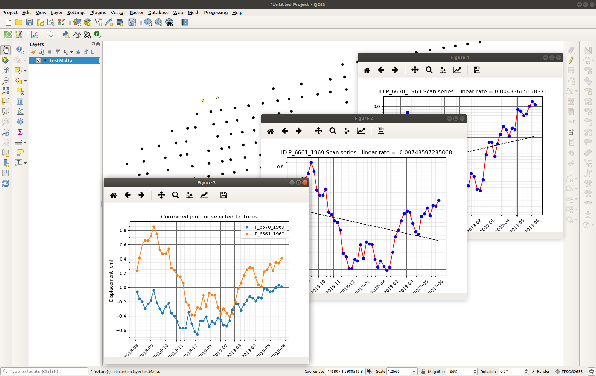
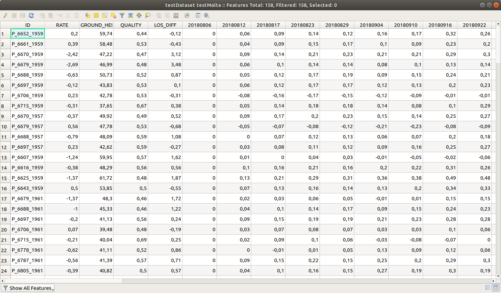

# P-SARRET  - Plugin SAR displacement ReusE Timeseries

QGIS plugin to visualize SAR displacement time series.

## Description

The P-SARRET QGIS plugin allows to create and visualize time series plots from one or many point features selected in the QGIS canvas.

The plugin is conceived to be used with layers containing target points related to displacement values derived from SAR images, but it can be used for any point dataset having columns that describe the trend of a parameter at different times.

## Installation

The P-SARRET plugin is not an official QGIS plugin.

It can be installed downloading this repository, unzipping the file and copying the psarrett folder in your local python/plugin folder (read [here](https://docs.qgis.org/3.4/en/docs/user_manual/plugins/plugins.html#core-and-external-plugins) for more information).

## Usage

To test the use of the plugin, you can use the file [testDataset.shp](./examples/testDataset.shp) in the folder _examples_, containing 158 points. For each point, several columns are present containing a displacement values (in cm), derived from SAR images using [...]

The workflow to use the plugin, once installed and activated, is the following:
1. select some (1 or many) point features in the canvas,
2. click on the icon 

For each selected point, one floating window will show up, containing a time series plot and a regression line; an additional plot will appear, showing the time series for all the selected points.


_Fig. 1 Example of output of the P-SARRET plugin: 2 point features are selected in the canvas; 3 plots are shown: 2 for the single points time series, 1 for the combined plot._

The columns containing time-series values to be plotted are selected in the script through the code
```
datetitle = field_names[6:-1]
```
where `[6:-11]` selects the columns from the 7th to the last (20180812, 20180817, ..., 20190613).


_Fig. 2: Attribute table of the test dataset. The columns 20180806, 20180812, 20180817, ... contains the time-series values to be plotted._

If you want to use your own data, be sure to adapt that part of code matching the structure of your dataset.

## Credits

Stefano Crema Giacomo Titti, Alessandro Sarretta and Matteo Mantovani, CNR-IRPI, Padova, Dec. 2019

## License

The P-SARRET code is released under a GNU General Public License v3.0
